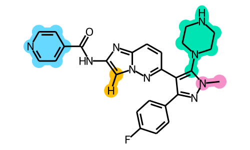

# MolSHAP

Interpreting Quantitative Structure-Activity Relationships using Shapley Values of R-Groups



For details, please refer to our [J. Chem. Inf. Model.](https://doi.org/10.1021/acs.jcim.3c00465) paper.

If you find this software useful in your work, please cite our paper.

## Requirements
- python = 3.7
- rdkit = 2021.09.2
- sklearn = 1.0.1
- shap = 0.41.0
- numpy
- scipy
- pandas

## Pipelines

### Step1. Prepare data

A table containing a number of congeneric compounds is required as input.
Specifically, each compound shoule be organized as a single row with its `ID`, `SMILES`, and `Activity` as columns.
The activity should be in log scale, e.g., pKi, pIC50, -log10\[Mol/L\].
Note that other properties, if can be decomposed into side chains, can also be used for analyzing.
Properties such as T1/2 (time), Tmax (time) are not suitable here.

For example, 

| ID | SMILES | Activity |
|---|---|---|
| 1 | CCN1C2=C(\[C@@H\](\[C@H\](NC(=O)C3=CC=CC=C3)C1=O)C1=CC=C(F)C=C1)C(C)=NN2C1=CC=CC=C1 | 5.88 |
| 2 | CCN1C2=C(\[C@@H\](\[C@H\](NC(=O)C3=CC(C)=CC=C3)C1=O)C1=CC=C(F)C=C1)C(C)=NN2C1=CC=CC=C1 | 6.70 |
| 3 | CCN1C2=C(\[C@@H\](\[C@H\](NC(=O)C3=CC(Cl)=CC=C3)C1=O)C1=CC=C(F)C=C1)C(C)=NN2C1=CC=CC=C1 | 6.19 |

### Step2. Side-chain decomposition

Run the following script for side-chain decomposition using auto scaffold:
```
python decompose.py -i ./demo/demo.csv -o ./demo/ 
```

You may also specify the scaffold in SMILES format with `-c` option:
```
python decompose.py -i ./demo/demo.csv -c O=C1C\(N[*:5]\)C\([*:4]\)c2c\([*:3]\)nn\([*:2]\)c2N1[*:1] -o ./demo/ 
```
Note that the special characters (e.g., `(`, `)`) in SMILES should be converted using backslash (e.g., `\(`, `\)`).

You can modify the scaffold until satisfaction.

### Step3. Build model

Run the following script for MolSHAP analysis:
```
python molshap.py -i ./demo/demo.csv -o ./demo/ 
```

## Outputs
| filename | description |
|---|---|
|`prefix`_decomp.pk | Decomposition results |
|`prefix`_frag2idx.pk | Mapping from fragment SMILES to index |
|`prefix`_contrib.pk | Side-chain fragment contributions by index |
|`prefix`_contrib_by_smiles.pk | Side-chain fragment contributions by SMILES |
|`prefix`_opt.csv | Table of optimized compounds |
|`prefix`_opt.png | Scatter plot of optimized compounds |
